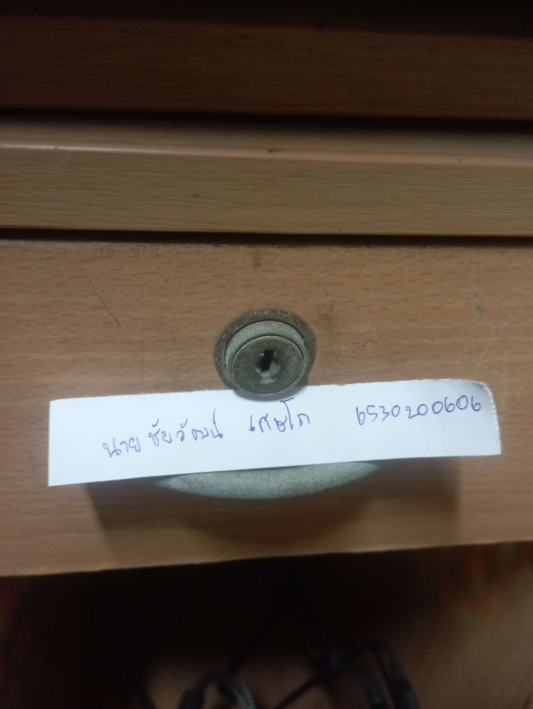

# Security Control
## กลอนลิ้นชัก

## สถานที่
  หอพักนิสิต มหาวิทยาลัยเกษตรศาสตร์ ศรีราชา
## Control Function : Preventive Control
## Type of Security Control : Physical Control
  กลอนล็อคที่เป็นตัวล็อคลิ้นชักจะป้องกันบุคคลอื่นๆ ไม่ให้สามารถใช้งานลิ้นชักได้ หากไม่มีลูกกุญแจในการไขตัวล็อค คนที่มีเท่านั้นจึงจะสามารถไขเปิดลิ้นชักได้
โดยให้ ลูกกุญแจที่ทำการล็อคและไขออก เป็น Physical Control และการที่คนที่ไม่มีกุญแจไม่สามารถเปิดลิ้นชักได้เป็น Preventiuve Control
